---

## Шаг 1. Patroni CLI: состав и состояние кластера
Команда (в любом patroni-контейнере):

Скриншот вывода `patronictl list`:  

```md
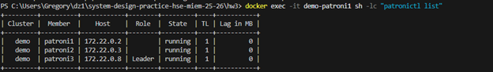
```

**Вывод по кластеру:**  
- Кластер `demo` состоит из 3 PostgreSQL нод под управлением Patroni: `patroni1`, `patroni2`, `patroni3`.  
- Одна нода находится в роли **Leader (master)** — принимает запись.  
- Остальные ноды — **Replica** (репликация, чтение, 0 lag при нормальной работе).  
- `TL` (timeline) увеличивается при failover.  

---

## Шаг 2. Проверка состояния HAProxy


Скриншот страницы статистики HAProxy:  

```md
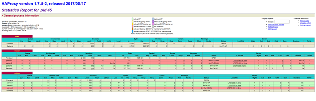
```

**Выводы:**  
- HAProxy показывает фронтенды/бэкенды и состояние health-check.  
- HAProxy маршрутизирует трафик на актуального лидера и/или реплики (в зависимости от порта).  
- При переключении лидера статус бэкендов меняется без смены адреса для клиента.

---

## Шаг 3. Подключение к master и replica + прогон SQL-скрипта
> В моём docker-compose порты HAProxy проброшены так:  
> - `localhost:5002 -> haproxy:5000` (write/master)  
> - `localhost:5001 -> haproxy:5001` (read/replica)  
> Поэтому `pg_is_in_recovery()` помогает проверить, куда реально попали.

### 3.1 Подключение к master и replica


Скриншот: master + `pg_is_in_recovery()` + select из events после прогона SQL-скрипта из задания:  

```md
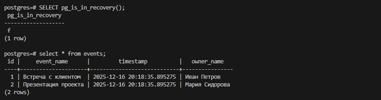

```
Скриншот: replica + `pg_is_in_recovery()` + select из events после прогона SQL-скрипта из задания

```md
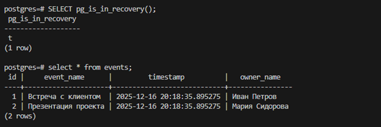

```


## Шаг 4. Traffic generator 


Скриншот stdout скрипта:  

```md
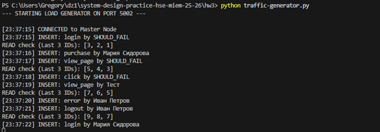

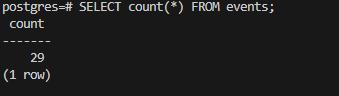
```

**Наблюдение:**  
- Запись идёт в master (через HAProxy write-порт).  
- Чтение выполняется стабильно (через read-порт/реплики).  

---

## Шаг 5.Отказоустойчивость (не останавливая traffic-generator)
### 5.1 Отключение лидера Patroni

Скриншоты:
- После остановки лидера (видно нового Leader): 
```md
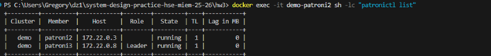
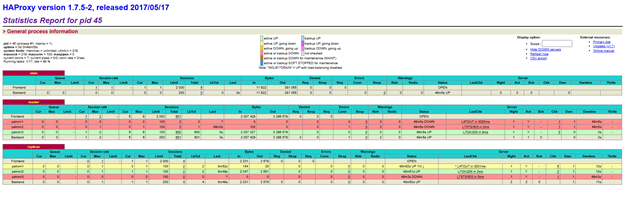
```

**Вывод:** лидер переизбирается автоматически. Клиент продолжает работать через HAProxy.

### 5.2 Отключение реплики
```
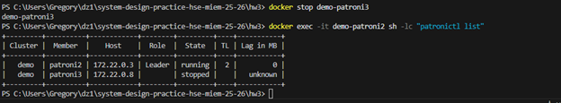
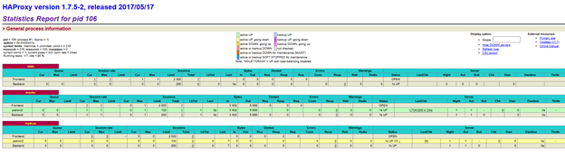
```
**Вывод:** запись в master продолжает работать, но снижается отказоустойчивость и уменьшается количество реплик для чтения.

### 5.3 Отключение etcd-ноды
```

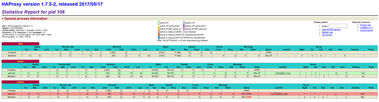
```
**Вывод:** при кворуме (2 из 3) кластер продолжает работать. Если выключить 2 etcd-ноды — DCS станет недоступен, и автоматическое управление нарушится.

### 5.4 Отключение HAProxy
```
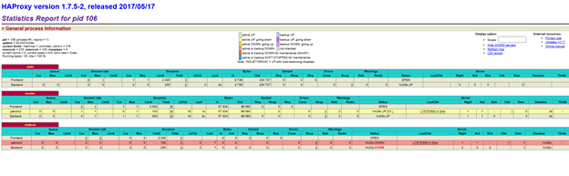
```
**Вывод:** приложение, которые подключаются только через HAProxy, потеряют точку входа - это SPOF балансировщика. В проде обычно делают 2 HAProxy + VIP (Keepalived) или внешний LB.

Скриншоты HAProxy при failover:  
```
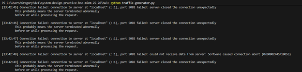
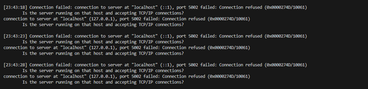
```

---

## Итог
- Развернул HA-кластер PostgreSQL (3 Patroni + 3 etcd + HAProxy).  
- Проверил, что master принимает запись, реплики обслуживают чтение (через `pg_is_in_recovery()`).  
- Запустил traffic-generator и подтвердил непрерывные операции чтения/записи.  
- Проверил failover при остановке лидера: лидер переизбирается автоматически, сервис остаётся доступен через HAProxy.
