## Шаг 1-2. Запуск кластера
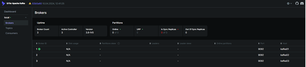

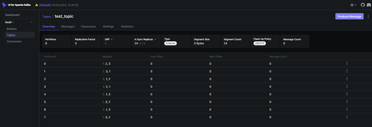

---

## Шаг 3. Проверка конфигурации топика
Создан тестовый топик `test_topic` со следующими характеристиками:
- **Partitions:** 8  
- **Replication factor:** 3  
- **In-Sync Replicas (ISR):** все реплики в синхроне  

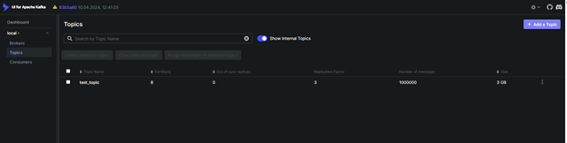

**Почему так:**
- 8 партиций позволяют масштабировать throughput за счёт параллельной записи и чтения.
- Replication factor = 3 обеспечивает отказоустойчивость: данные хранятся на всех брокерах.
- При падении одного брокера данные остаются доступными.

---

## Шаг 4. Нагрузочное тестирование (НТ)
Выполнен нагрузочный тест с помощью `kafka-producer-perf-test`

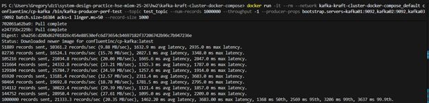

### Результаты:
- **Throughput:** около 21 300 records/sec  
- **Data rate:** около 20 MB/sec  
- **Latency:**
  - avg ≈ 1460 ms
  - p50 ≈ 1368 ms
  - p95 ≈ 2569 ms
  - p99 ≈ 3206 ms
  - max ≈ 3683 ms

В Kafka UI подтверждено:
- все сообщения успешно записаны
- количество сообщений = 1 000 000
- репликация корректна (ISR = 24/24)
- данные присутствуют на всех брокерах

---

## Шаг 5. Отказоустойчивость

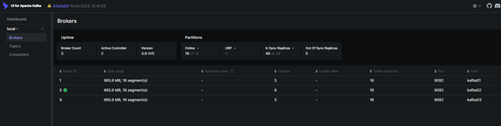

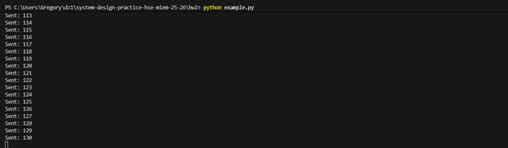

### 5.1 Убийство контроллера

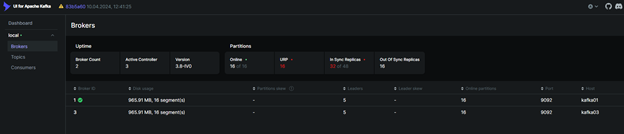

При остановке брокера-контроллера:
- контроллер был автоматически переизбран
- кластер продолжил работу
- producer продолжил отправку сообщений
- увеличилось число URP и уменьшился ISR (ожидаемо)

### 5.2 Убийство 2 из 3 брокеров

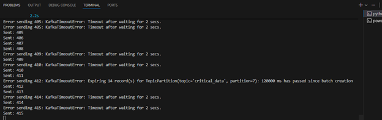
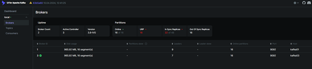
После остановки второго брокера:
- кластер потерял кворум (1 из 3)
- запись в топик стала невозможна
- producer начал получать ошибки `KafkaTimeoutError`

**Причина:**  
Для принятия решений требуется большинство (2 из 3). Без кворума Kafka предпочитает консистентность доступности.

**ISR (In-Sync Replicas):**  
Это реплики, которые полностью синхронизированы с лидером. При падении брокеров ISR уменьшается, и запись становится невозможной.

### 5.3 Восстановление

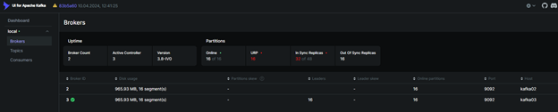
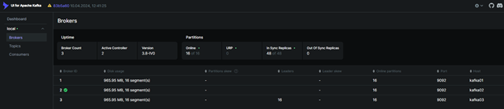
После восстановления брокеров:
- кластер вернулся в здоровое состояние
- ISR полностью восстановился
- данные остались консистентными
- запись в топики снова возможна

---

## Итог
- Kafka кластер успешно развернут в режиме KRaft
- Проведено нагрузочное тестирование
- Проверена отказоустойчивость при падении 1 и 2 брокеров
- Продемонстрированы механизмы:
  - репликации
  - ISR
  - кворума Raft
  - Consistency over Availability

